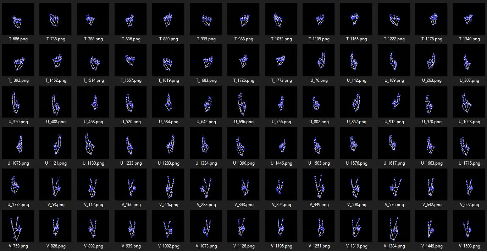
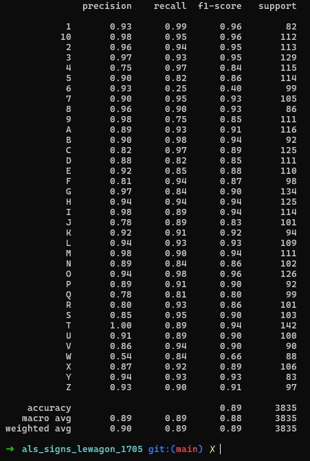
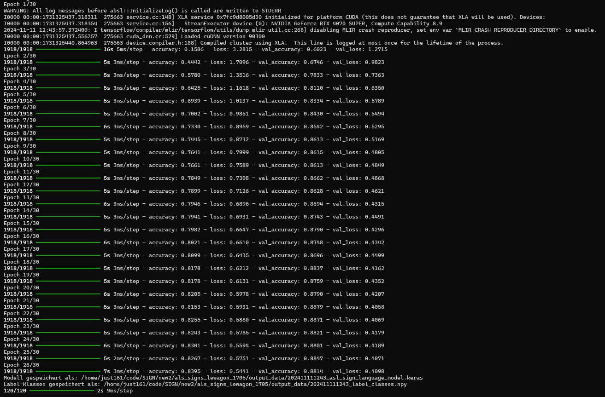

# ASL Sign Language Recognition with TensorFlow

This project uses a deep learning model to recognize American Sign Language (ASL) hand gestures. The system is trained using hand landmark data extracted from images and can be deployed as a web-based app via Gradio, allowing users to test the model.

This project was developed as part of the Data Science Bootcamp by Le Wagon (#1705) as a team effort with Diana, Gabriel, Jean-Michel, Robert, and Boris.

## Files Overview

### Training

- **Purpose**: Trains a CNN-based model on ASL alphabet images.
- **Workflow**:
  - **Data Augmentation**: Augments training images with transformations (brightness, zoom, etc.).
  - **Landmark Extraction**: Uses MediaPipe to extract hand landmarks.
  - **Model Architecture**: Defines and trains a CNN model.
  - **Output**: Saves the trained model and label classes for deployment.

### App

The app is a web-based interface designed for testing the ASL sign language model. It processes images and provides predictions based on detected hand landmarks.

- **Image Processing**:
  - Adjusts brightness, detects hand landmarks, and normalizes them for accurate predictions. Uses helper functions for data normalization (`normalize_landmarks`) and image adjustments (`adjust_brightness_contrast`).
  
- **Model**:
  - Loads the trained model and label classes for ASL recognition. The `predict` function processes the input image, identifies the ASL letter, and outputs a confidence score for the prediction.

- **User Interface**:
  - The app, built with Gradio, allows users to upload images for ASL gesture predictions.
  - **Input**: Accepts an image for model prediction.
  - **Output**: Provides an annotated image and JSON output containing the predicted letter and the model’s confidence level.

## Usage

1. **Training**:
   - Run `training.py` to train the model on your dataset of ASL hand gestures.
   
2. **Inference**:
   - Launch `main.py` to open a Gradio interface where users can upload images to test the model's predictions.

## Requirements

- TensorFlow
- MediaPipe
- Gradio
- OpenCV
- NumPy
- PIL

## License

This project is open-source and licensed under the MIT License.

